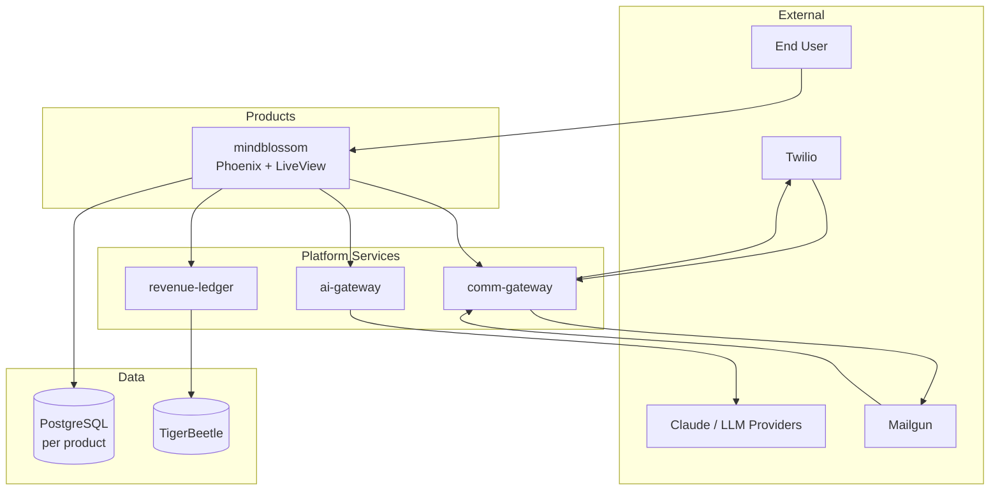

# Platform Architecture Overview

## Vision

Project Whirlwind is a platform of shared infrastructure services on top of which independent products are built. Products are isolated from each other. Shared services are independently deployed and versioned. API contracts define all inter-service communication.

The first product is MindBlossom v2. Future products inherit the platform without inheriting any product's code.

---

## Principles

**1. Contracts over coupling.**
Services never import each other's code. All communication is over HTTP via published OpenAPI specs in `api-contracts`. A service can be rewritten in a different language as long as it satisfies its contract.

**2. Shared infrastructure, isolated products.**
`comm-gateway`, `ai-gateway`, and `revenue-ledger` are platform services used by any product. Product repos (`mindblossom`, etc.) contain only product-specific logic.

**3. Boring technology.**
Elixir/Phoenix, PostgreSQL, Docker Compose. These are not trendy choices — they are proven, well-documented, and operable by a small team. Novelty requires justification.

**4. Local-first development.**
Every service runs locally via Docker Compose without cloud dependencies. `infra-local` is the local harness for the full platform stack.

**5. Explicit over implicit.**
Error handling, retries, timeouts, and authentication are explicit at every service boundary. No silent failures.

---

## Platform diagram



---

## Service roles

| Service | Role | Owned data |
|---------|------|-----------|
| `mindblossom` | Full-stack product — LiveView UI, business logic, auth, user data | Postgres (product DB) |
| `comm-gateway` | Inbound/outbound SMS and email | None — stateless router |
| `ai-gateway` | AI completions, conversation state, provider routing | Conversation threads |
| `revenue-ledger` | Revenue attribution, profit tracking, co-op ledger | TigerBeetle |
| `infra-local` | Local dev harness | N/A |
| `api-contracts` | Interface definitions | N/A |

---

## Data flow: inbound SMS with AI response

Twilio requires a webhook response within 15 seconds. `comm-gateway` responds immediately and all downstream work is async.

```
Twilio → comm-gateway POST /v1/webhooks/twilio
              │
              ├─ 1. Validate Twilio signature (reject 403 if invalid)
              ├─ 2. Apply safety limits (rate, size, link count)
              ├─ 3. Enqueue delivery job (Oban)
              └─ 4. Respond 200 immediately ← Twilio marks delivered

         (async — Oban job)
              │
              ▼
         POST sms_received event → mindblossom
              │
              ▼
         mindblossom
         Stores message (idempotent on provider_message_id)
         Enqueues Oban job: ProcessInboundSms
              │
              ▼
         ProcessInboundSms worker
         Builds context (user's recent messages/links)
         POST /v1/chat → ai-gateway
              │
              ▼
         ai-gateway
         Calls Claude with tools
         Returns completion
              │
              ▼
         mindblossom
         POST /v1/messages/sms → comm-gateway
              │
              ▼
         comm-gateway → Twilio API → User's phone
```

---

## Deployment model

Each service is an independent Docker Compose application deployed via Dokploy on a VPS. Services communicate over an internal Docker network or via HTTP on known internal hostnames.

See [ADR-006 — Dokploy](../decisions/ADR-006-dokploy.md) for rationale.

```
VPS (Dokploy)
├── comm-gateway        (container)
├── ai-gateway          (container)
├── revenue-ledger      (container)
├── mindblossom         (container)
└── postgres            (managed or container)
```

---

## Technology baseline

| Layer | Technology | Applies to |
|-------|-----------|-----------|
| Backend language | Elixir / Phoenix | All services |
| Primary database | PostgreSQL 16 | All products, ai-gateway |
| Financial ledger | TigerBeetle | revenue-ledger only |
| Background jobs | Oban (on Postgres) | All Phoenix services |
| Deployment | Docker Compose + Dokploy | All services |
| AI provider proxy | LiteLLM | ai-gateway |
| Local dev | Docker Compose | infra-local |
